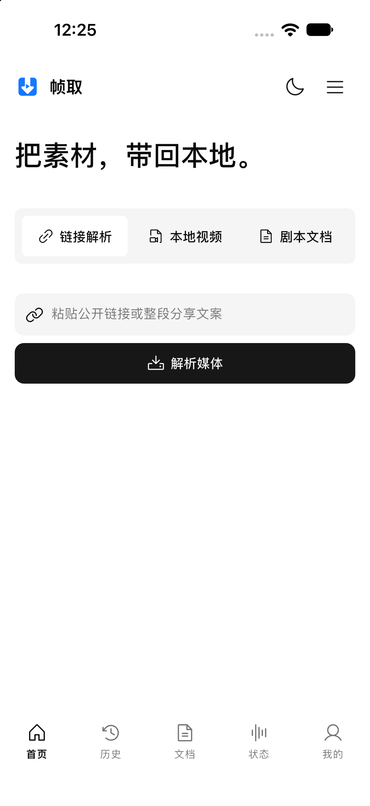
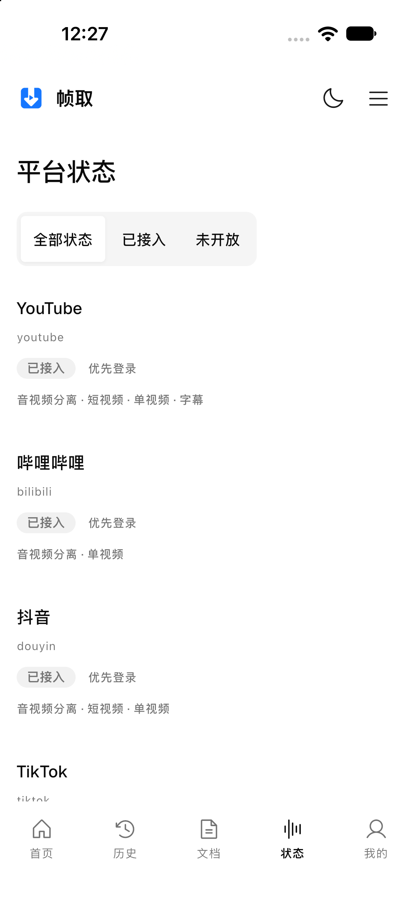

# FrameFetch App

**An open-source, self-hosted personal video and screenplay workstation, on your phone.**

[简体中文](README.md) · [Server / Web](https://github.com/StephenQiu30/video-server) · [Desktop](https://github.com/StephenQiu30/video-electron) · [Get started](#get-started) · [Design documentation](docs/design/README.md)

[](https://github.com/StephenQiu30/video-app/actions/workflows/flutter-quality.yml)
[](#platforms-and-installation)
[](https://github.com/StephenQiu30/video-app/releases)
[](LICENSE)

FrameFetch is an open-source, self-hosted personal video and screenplay workstation, connecting media acquisition, video review, screenplay coverage and report preparation. This repository provides its **native iOS and Android client**: inspect public links, import local videos and screenplays, confirm formats, follow jobs, play videos, read AI results, and save or share reports.

The app, Web interface and Electron desktop client connect to the same FrameFetch server and share accounts, media, jobs and reports. The phone handles native interaction and presentation; your [`video-server`](https://github.com/StephenQiu30/video-server) owns inspection, downloading, storage, authorization and AI execution.

Latest public source preview: [v0.2.0-beta.1](https://github.com/StephenQiu30/video-app/releases/tag/v0.2.0-beta.1). Deploy the server first, then run the app from source below; see [platforms and installation](#platforms-and-installation) for distribution details.

## App preview

<p align="center">
  
  &nbsp;&nbsp;
  
</p>

<p align="center"><sub>Current native iOS home and provider status, sharing the official logo, neutral palette and component semantics with Web. These screenshots show native UI and platform declarations; they do not replace real-account, provider, model or device workflow acceptance.</sub></p>

## What you can do

### Bring three types of input into one workflow

- **Public links:** paste one media URL or share text containing one URL for a single video, image gallery or bounded video collection according to the platform's actual capabilities. Review the source, cover, duration and actual formats. WeChat official-account articles provide source discovery only; current candidates expose no downloadable formats. Follow the returned action for official playback or import a file you are authorized to use.
- **Local videos:** choose an MP4 through the system file picker, upload it to your server, and continue with the same media details, playback and analysis workflow.
- **Screenplays:** import DOCX, text-based PDF with extractable text, TXT, Markdown or Fountain. Review language, scene and character counts, parsing summaries, quality notes and normalized text. Screenplay files are limited to 50 MB.

Uploads use streaming SHA-256 and bounded multipart transfer, validate parts and ETags, and expose progress and cancellation. System file access is explicitly authorized by the user; a complete video is not loaded into memory at once.

### Confirm the format before downloading

Inspection shows the server's actual resolution, container, compatibility policy, video/audio codecs, and image-set or collection counts. A download starts after you confirm a format. Its detail screen shows status, stage, progress, execution count, file availability and failure reasons, with individual cancellation, retry and deletion actions. Galleries and bounded video collections are delivered as ZIP files containing `manifest.json`, recording the title, media kind and item count.

Inspection has a persistent record of its own. Opening the app again or entering from another screen can recover that record; expired ready results can be refreshed and confirmed again. Uncertain requests converge by reading the original record to avoid duplicate jobs.

### Read complete AI results on your phone

The app reads the server's Skill catalog. Choose a video or screenplay method, Chinese or English output, and your analysis focus. The current server bundles **12 video methods and 8 screenplay methods**, with the same catalog shared by App, Web and desktop. Video methods include storyboard creation (`visual-shots`), director breakdown (`director-breakdown`), highlight extraction (`highlights`), WeChat articles (`video-to-article`) and short-video packaging (`short-video-packaging`). Screenplay methods include story review, structure review, character/conflict review, dialogue review and Chinese/English rewriting. The complete catalog and purposes are maintained in the server's [12 video analysis methods](https://github.com/StephenQiu30/video-server/blob/main/README.en.md#12-video-analysis-methods) and [8 screenplay analysis methods](https://github.com/StephenQiu30/video-server/blob/main/README.en.md#8-screenplay-analysis-methods); see the [server Skill design](https://github.com/StephenQiu30/video-server/blob/main/docs/design/16-Skill体系与结果契约.md) for method and result contracts.

Method counts describe the current catalog; they do not mean every method has passed real-model and device workflow acceptance.

Five result types have native readers:

| Result | Content you can explore |
| --- | --- |
| Video visual analysis | Shots, visual scene rules, narrative functions, transitions, continuity risks and asset evidence |
| Video article | Article content, timecodes and media evidence |
| General structured report | Metrics, sections, findings, recommendations and limitations |
| Screenplay analysis | Story overview, act structure, turning points, pacing, character goals/conflicts, dialogue and paginated scene reviews |
| Screenplay rewrite | Glossary, revision summary and the complete rewritten report |

The server's strict continuous-shot timeline validation applies to video visual analysis results; other results follow their own validation and presentation contracts.

Start, cancel, retry, rerun or delete analyses independently of download status. Save available Markdown or DOCX artifacts to the device, and send the complete Markdown report through the system share sheet. Report export retrieves the server's canonical full text. Both exports come from the same structured result without another model call; article drafts, packaging copy and screenplay rewrites remain editable candidates for human review.

### Keep media and every processing run connected

Download and screenplay lists support search, status filters and pagination. **Unified activity history** brings link inspection, document parsing, video analysis and screenplay analysis together, with type, status, method, keyword and date filters. You can also view the records associated with one source.

A historical analysis opens the exact selected analysis ID, including its method, language and run count. Execution history shows each run's time, status and failure reason. Completed historical reports remain readable when their source is no longer available.

### Use native playback, account tools and mobile administration

- **Playback and files:** media_kit/libmpv provides native video playback and controls. File access uses short-lived server authorization and preserves the original artifact format.
- **Account:** email-code registration, sign-in, startup session restoration, username and avatar management, and sign-out. Protected deep links resume their intended screen after login.
- **Provider status:** read platform registration status, identity requirements and declared capabilities. Filter by All statuses, Registered or Not enabled, and refresh.
- **Administration:** six areas for analytics, files, users, provider catalog, AI services and operation logs. Download/AI analytics offer 7/30/90-day windows; administrators can configure roles, active status and task/data/storage/analysis quotas, and configure or activate AI routes.
- **Experience:** five bottom-navigation destinations, persistent light/dark switching, Chinese/English localization, scalable text, screen-reader semantics and native save/share flows, with the Web shadcn neutral design baseline.

## Typical workflows

### From material to report

1. **Bring it in:** sign in to your server and paste one public link or share message, or upload your own MP4 or screenplay.
2. **Confirm:** review access decisions, source and actual formats; choose a video format, or check gallery/collection counts and confirm the ZIP download.
3. **Obtain:** create a download or import job, follow progress, and cancel, retry or recover historical records as its state allows.
4. **Manage:** play videos, retrieve files or read normalized screenplay text in details; all clients use the server's originals, media states and reports.
5. **Analyze:** select a video or screenplay Skill, output language and focus, and start server-side analysis independently of media acquisition.
6. **Deliver:** read results with video time or screenplay scene references, save Markdown/DOCX, or share the complete Markdown report for further editing.

For an existing MP4, upload it from the local-video entry point, open its media details and continue from step 5. Shared workflow and deliverables are documented in the [server's complete workflow](https://github.com/StephenQiu30/video-server/blob/main/README.en.md#from-material-to-report).

### Review or rewrite a screenplay

1. Choose and upload a document from the screenplay entry point.
2. Check parsing quality, scene information and normalized text.
3. Select an analysis or rewrite method and describe your focus.
4. Explore structure, character, dialogue and scene findings, then read or export the complete report.
5. Use the source's activity records to revisit different analysis runs.

### Administer your service

Administrators open the management center from the account tab to inspect download/AI usage, maintain quotas, files, provider catalog and AI routes, and inspect operations and job results. The server validates roles, ownership and state for every management action.

## How the three projects work together

| Project | Entry point and responsibility |
| --- | --- |
| [`video-server`](https://github.com/StephenQiu30/video-server) | FastAPI API, Next.js Web, inspection/downloads, AI workers, identity, permissions, queues, storage and reports |
| [`video-electron`](https://github.com/StephenQiu30/video-electron) | Electron desktop entry point with bundled React pages reusing Web business source, the same server, native windows and system file saving |
| **`video-app`** | Native Flutter iOS/Android screens, Bearer sessions, system file entry points, playback and mobile administration |

All three clients share the same server business data; switching clients does not create a separate media-job or business database. The app's client is generated from a reviewed mobile-only OpenAPI snapshot. It does not maintain parallel server DTOs. Active inspections, downloads, documents and analyses converge through REST queries; history and results follow server state. The app currently does not use WebSocket status updates.

## Technology choices

| Technology | Product capability |
| --- | --- |
| Flutter 3.44.7 / Dart 3.12.2 | One native business codebase for iOS and Android |
| Riverpod 3 | One-way state, dependency assembly and replaceable data boundaries |
| go_router | Typed routes, deep links and return after authentication |
| Dio + OpenAPI Generator 7.22.0 | Shared networking and a generated `dart-dio` contract client |
| shadcn_ui + Phosphor | Shared Web component semantics, neutral colors and line icons |
| media_kit + libmpv | Native playback and a cross-platform decoding runtime |
| file_selector + multipart upload | System-authorized file access and streaming transfer |
| flutter_secure_storage | Keychain/Keystore-backed native refresh credentials |
| Flutter ARB + shared_preferences | Chinese/English UI and non-sensitive theme preferences |

Exact dependency versions are defined in [`pubspec.yaml`](pubspec.yaml) and [`pubspec.lock`](pubspec.lock).

## Get started

### 1. Prepare the server and toolchain

Deploy the API, Web and workers with the [video-server quick start](https://github.com/StephenQiu30/video-server/blob/main/README.en.md#quick-start), then obtain a server address reachable from your device.

| Environment | Requirement |
| --- | --- |
| Flutter / Dart | Flutter 3.44.7 stable / Dart 3.12.2 |
| iOS | Xcode 27, iOS 16+, CocoaPods |
| Android | JDK 21, Android API 24+, JVM target 17 |
| Server | A reachable `video-server`; valid HTTPS in production |

```bash
git clone https://github.com/StephenQiu30/video-app.git
cd video-app
git checkout v0.2.0-beta.1
flutter doctor -v
flutter pub get --enforce-lockfile
```

### 2. Connect and run

iOS Simulator with a server on your computer:

```bash
flutter run \
  --dart-define=VIDEO_SERVER_BASE_URL=http://127.0.0.1:8111
```

Android Emulator with a server on its host:

```bash
flutter run \
  --dart-define=VIDEO_SERVER_BASE_URL=http://10.0.2.2:8111
```

Physical devices and production instances:

```bash
flutter run \
  --dart-define=VIDEO_SERVER_BASE_URL=https://your-framefetch.example.com
```

`VIDEO_SERVER_BASE_URL` points to the API service. `localhost` on a phone refers to the phone itself; use a reachable address for physical devices. Sign in to that service to access its account and media.

### 3. Build the client

```bash
flutter build apk --debug \
  --dart-define=VIDEO_SERVER_BASE_URL=https://your-framefetch.example.com

flutter build ios --simulator --no-codesign \
  --dart-define=VIDEO_SERVER_BASE_URL=https://your-framefetch.example.com
```

The debug APK is written to `build/app/outputs/flutter-apk/app-debug.apk`; iOS Simulator artifacts are in `build/ios/iphonesimulator/`. See [accessibility and quality](docs/design/11-可访问性与质量.md) for the current Xcode 27 universal Simulator build issue and the arm64 run path. Device and store distribution require platform release signing; signing materials do not belong in the repository.

## Platforms and installation

The client targets **iOS 16+ and Android API 24+** and is built from source. [v0.2.0-beta.1](https://github.com/StephenQiu30/video-app/releases/tag/v0.2.0-beta.1) is a public source preview: the GitHub tag identifies the source snapshot, while the embedded app build version remains **`0.1.0+1`**. This release has no attached APK/IPA and no prebuilt App Store/Google Play package. This repository does not enable Flutter Web; the desktop entry point is [`video-electron`](https://github.com/StephenQiu30/video-electron).

The app depends on an online self-hosted service. Inspection, downloading and AI analysis run on the server. Offline AI, persistent background downloading, offline media libraries and batch jobs are outside the current scope. Server inspection determines platform access and available formats.

## Security and privacy

- Access tokens remain in memory; refresh credentials use Keychain/Keystore-backed storage. Concurrent authentication failures share one refresh and isolate responses from old sessions.
- Explicitly selected local files are sent through bounded upload sessions to your server's object storage. The native app does not store third-party provider cookies or run extractors or AI models on the phone.
- When you choose an external model route, content needed for analysis is sent to that provider. Use media in accordance with your authorization and the selected service's rules.
- Tokens, full media URL queries, presigned URLs, user media and raw AI responses must not enter logs. Process content you own or are explicitly authorized to use.
- Report vulnerabilities according to [`SECURITY.md`](SECURITY.md).

## Development and documentation

```text
lib/app/                      Bootstrap, dependency assembly and routing
lib/core/                     Configuration, networking, credentials and theme
lib/features/                 Media, downloads, documents, analysis, account and admin
lib/l10n/                     ARB localization
lib/shared/                   Reusable presentation components and models
contracts/openapi/            Mobile-only OpenAPI snapshot
packages/video_server_api/    Generated Dart API client
test/ · integration_test/     Unit, Widget and native workflow tests
tool/                         Contract generation, checks and theme synchronization
docs/design/                  Product, architecture and verification conditions
```

Documentation entry points:

- [Product and architecture](docs/design/README.md), [engineering conventions](PROJECT.md), [visual design](design.md)
- [Link inspection and downloading](docs/design/06-链接解析与下载.md), [uploads and screenplays](docs/design/07-文件上传与剧本文档.md)
- [AI analysis and reports](docs/design/08-AI分析与报告.md), [mobile administration](docs/design/09-移动管理中心.md)
- [OpenAPI generation](tool/openapi/README.md), [contributing](CONTRIBUTING.md)

Routine code checks:

```bash
dart run tool/openapi.dart --from-snapshot --check
dart run tool/check.dart
```

`tool/check.dart` checks the toolchain and runs dependency installation, generation, formatting, static analysis and unit/Widget tests. Integration verification for real authentication, uploads, models and system save/share also requires the matching server and device conditions; see [quality requirements](docs/design/11-可访问性与质量.md).

## Contributing

Issues and suggestions are welcome at [GitHub Issues](https://github.com/StephenQiu30/video-app/issues). Read [`CONTRIBUTING.md`](CONTRIBUTING.md) and [`CODE_OF_CONDUCT.md`](CODE_OF_CONDUCT.md) before contributing. Report mobile UI, native sessions and device behavior here; API, Web, inspection, storage and AI worker issues belong in [video-server](https://github.com/StephenQiu30/video-server/issues).

For research, reports or teaching materials, cite [`CITATION.cff`](CITATION.cff).

## License

[MIT](LICENSE) © 2026 Stephen Qiu
