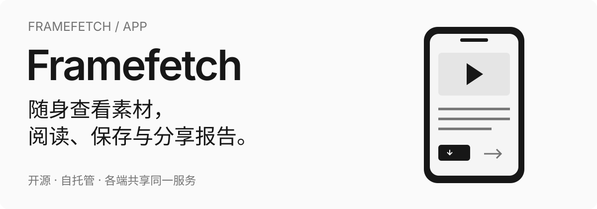

<p align="center">
  
</p>

#  帧取 · FrameFetch App

**帧取工作站的 iOS / Android 原生客户端。** 接入素材、跟踪任务，在手机上播放视频、阅读报告、保存文件与系统分享。连接你部署的 FrameFetch Server，和 Web、桌面共享账户、素材与报告。

[](https://github.com/StephenQiu30/video-app/actions/workflows/flutter-quality.yml)
[](#平台与安装)
[](https://github.com/StephenQiu30/video-app/releases)
[](LICENSE)

[开始使用](#开始使用) · [可以做什么](#可以用它做什么) · [平台与安装](#平台与安装) · [Server / Web](https://github.com/StephenQiu30/video-server) · [桌面端](https://github.com/StephenQiu30/video-electron) · [English](README.en.md)

> **源码预览**：[v0.2.0-beta.1](https://github.com/StephenQiu30/video-app/releases/tag/v0.2.0-beta.1) 未提供 APK / IPA 或商店安装包。先部署 Server，再从源码运行原生客户端。

## App 预览

<p align="center">
  
  
</p>

<p align="center"><sub>当前 iOS 原生首页与平台状态；使用与 Web 相同的正式 Logo、neutral 配色与组件语义。截图展示原生界面和平台声明，不替代真实账户、Provider、模型或设备业务验收。</sub></p>

## 开始使用

### 1. 准备服务与工具链

先按 [video-server 快速开始](https://github.com/StephenQiu30/video-server#快速开始) 部署 API、Web 与 Worker，准备手机可访问的服务地址。

| 环境           | 要求                                            |
| -------------- | ----------------------------------------------- |
| Flutter / Dart | Flutter 3.44.7 stable / Dart 3.12.2             |
| iOS            | Xcode 27、iOS 16+、CocoaPods                    |
| Android        | JDK 21、Android API 24+，JVM target 17          |
| 服务端         | 设备可访问的 `video-server`；生产使用有效 HTTPS |

```bash
git clone https://github.com/StephenQiu30/video-app.git
cd video-app
git checkout v0.2.0-beta.1
flutter doctor -v
flutter pub get --enforce-lockfile
```

### 2. 连接服务并运行

iOS Simulator 连接电脑上的本地服务：

```bash
flutter run \
  --dart-define=VIDEO_SERVER_BASE_URL=http://127.0.0.1:8111
```

Android Emulator 连接宿主机：

```bash
flutter run \
  --dart-define=VIDEO_SERVER_BASE_URL=http://10.0.2.2:8111
```

真机与生产实例：

```bash
flutter run \
  --dart-define=VIDEO_SERVER_BASE_URL=https://your-framefetch.example.com
```

`VIDEO_SERVER_BASE_URL` 指向 API 服务。手机上的 `localhost` 是手机自身；真机请使用设备可达的服务地址。App 登录该服务后即可使用已有账户和素材。

### 3. 构建客户端

```bash
flutter build apk --debug \
  --dart-define=VIDEO_SERVER_BASE_URL=https://your-framefetch.example.com

flutter build ios --simulator --no-codesign \
  --dart-define=VIDEO_SERVER_BASE_URL=https://your-framefetch.example.com
```

调试 APK 位于 `build/app/outputs/flutter-apk/app-debug.apk`，iOS Simulator 制品位于 `build/ios/iphonesimulator/`。当前 Xcode 27 环境的通用双架构 Simulator 构建问题及 arm64 运行方式见[可访问性与质量](docs/design/11-可访问性与质量.md)。真机和商店分发需配置各平台正式签名，签名材料不进入仓库。

## 可以用它做什么

### 三种素材入口，衔接同一个工作流

- **公开链接**：粘贴单条媒体链接或含单条链接的分享文案，按平台实际能力接入单视频、图集或有限视频合集，读取来源、封面、时长和真实规格。公众号文章仅做来源发现，当前候选不提供下载格式，按提示官方播放或合法文件导入。
- **本地视频**：通过系统文件选择器导入 MP4，上传到自托管服务端，进入与远程素材相同的详情、播放和分析流程。
- **剧本文档**：导入 DOCX、文字型 PDF（可提取文字）、TXT、Markdown 或 Fountain，查看语言、场景数、字符数、解析摘要、质量提示及规范化正文。剧本文档上限为 50 MB。

上传采用流式 SHA-256 和受限分片直传，并校验分片与 ETag；可以查看进度或取消操作。App 使用系统授权的文件入口，不把完整视频一次性载入内存。

### 先确认规格，再执行下载

解析结果展示服务端实际返回的分辨率、容器、兼容策略、音视频编码，以及图集／合集数量。你确认规格后才创建下载任务，可在详情查看状态、阶段、进度、执行次数、文件可用性与失败原因，并进行单条取消、重试或删除。图集与有限视频合集以包含 `manifest.json` 的 ZIP 交付，清单记录标题、媒体类型与条目数量。

解析本身也有持久记录。重新打开 App 或从其他入口进入时可以读取原解析；就绪结果过期后显式更新，再次确认规格。未知请求结果先读取原记录，避免重复创建任务。

### 在手机上阅读完整 AI 结果

App 继续使用原有视频／剧本文档分析入口：选择 Skill、中文／英文输出，编辑分析重点或恢复该方法的默认要求。可调用方法以服务端目录为准；本轮优化成片审阅（`video-review`）、素材拆解（`video-breakdown`）、剧本审阅（`screenplay-analysis`），以及文章／公众号／小红书整理（`article-format`、`wechat-format`、`xhs-format`）。原有报告阅读、运行历史及 Markdown／DOCX 导出保持原页面和操作。方法与结果契约见 [服务端 Skill 设计](https://github.com/StephenQiu30/video-server/blob/main/workspace/content/design/09-AI分析.md)。

方法数量表示当前目录，不表示所有方法的真实模型与设备业务验收均已通过。

以下结果类型已有原生阅读视图，包含历史报告；当前可调用方法以服务端目录为准：

| 结果           | 在 App 中可以阅读的内容                                              |
| -------------- | -------------------------------------------------------------------- |
| 视频视觉分析   | 分镜、场景视觉规则、叙事作用、转场、连续性风险与资产证据             |
| 视频文章       | 文章内容、时间码与素材证据                                           |
| 通用结构化报告 | 指标、章节、关键发现、建议与限制说明                                 |
| 剧本分析       | 故事概述、幕结构、关键转折、节奏、人物目标与冲突、对白、分页场景细读 |
| 剧本改写       | 词汇表、修改摘要与完整改写报告                                       |

服务端的严格连续分镜时间轴校验针对视频视觉分析结果；其他结果按各自结果契约校验与呈现。

分析支持开始、取消、重试、重新分析和删除，状态独立于下载任务。Markdown／DOCX 制品可用时可保存到设备；完整 Markdown 报告还可以通过系统分享交给其他应用。报告读取服务端规范原文，包含完整内容。两种导出来自同一结构化结果，不需要重新调用模型；App 只读展示服务端保存的结果。

### 一份历史，串起素材与每次处理

下载记录与剧本文档提供搜索、状态筛选和分页。**统一处理记录**汇集链接解析、文档解析、视频分析与剧本分析，可按类型、状态、方法、关键词和时间查找，也可只查看某份素材的相关记录。

打开历史分析会进入所选分析 ID 的结果，保留方法、语言与运行次数；运行记录展示每次执行的时间、状态与失败原因。即使源文件已经不可用，已完成的历史报告仍可阅读。

### 原生播放、账户与移动管理

- **播放与获取文件**：media_kit／libmpv 提供原生视频播放与控制；文件通过服务端短期授权入口获取，保留服务端原始产物格式。
- **账户**：邮箱验证码注册、登录、启动会话恢复、用户名与头像管理、退出登录；受保护深链接在登录后继续原业务页面。
- **平台状态**：读取服务端平台接入状态、身份要求与能力声明，按全部状态、已接入、未开放筛选并刷新。
- **管理员**：使用统计、文件、用户、平台目录、AI 服务与系统操作日志六个管理入口。下载／AI 统计支持 7／30／90 天窗口，用户支持角色、启用状态与任务／处理量／存储／分析配额设置，AI 线路支持配置与激活。
- **体验**：五个底部入口、持久化浅色／深色切换、中英本地化、动态字体、读屏语义和系统保存／分享，与 Web 共用 shadcn neutral 视觉基线。

## 典型使用流程

### 从素材到报告

1. **接入**：登录自托管服务，粘贴单条公开链接或分享文案；也可上传自己的 MP4 或剧本文档。
2. **确认**：查看访问决策、来源与真实规格；视频选择格式，图集／合集核对条目数量并确认 ZIP 下载。
3. **获取**：创建下载或导入任务，在详情跟踪进度，按任务状态取消、重试或找回历史记录。
4. **管理**：在详情观看视频、获取素材或阅读规范化剧本；原件、素材状态和报告由各端共享的 Server 保存。
5. **分析**：对视频或剧本选择 Skill、输出语言和关注重点，启动服务端分析；分析状态独立于素材获取。
6. **交付**：结合视频时间或剧本场景依据阅读结果，保存 Markdown／DOCX，或分享完整 Markdown 报告继续编辑。

已有本地 MP4 时，从“本地视频”入口上传后直接进入素材详情，继续第 5 步。工作站共用流程与交付规则见 [Server 完整工作流](https://github.com/StephenQiu30/video-server#从素材到报告)。

### 管理自己的服务

管理员在“我的”进入管理中心，查看下载／AI 使用统计，维护账户配额、文件、平台目录和 AI 分析线路，并通过日志查找操作与任务结果。管理操作继续由服务端验证角色、资源归属与当前状态。

## 三个项目如何协作

| 项目                                                               | 入口与职责                                                                                       |
| ------------------------------------------------------------------ | ------------------------------------------------------------------------------------------------ |
| [`video-server`](https://github.com/StephenQiu30/video-server)     | FastAPI API、Next.js Web、解析与下载、AI Worker、账户权限、队列、存储和报告                      |
| [`video-electron`](https://github.com/StephenQiu30/video-electron) | Electron 桌面入口，随包 React 页面复用 Web 业务源码，连接同一 Server，提供原生窗口和系统文件保存 |
| **`video-app`**                                                    | Flutter iOS／Android 原生页面、Bearer 会话、系统文件入口、播放和移动管理                         |

三端共享同一服务端业务数据，切换客户端无需建立另一套媒体任务或业务库。App 通过经评审的 App 专用 OpenAPI 快照生成客户端，不维护另一套服务端 DTO。活动解析、下载、文档和分析状态以 REST 查询收敛，历史与结果以服务端事实为准；当前 App 未接入 WebSocket 实时状态。

## 平台与安装

当前客户端面向 **iOS 16+ 与 Android API 24+**，从源码构建。[v0.2.0-beta.1](https://github.com/StephenQiu30/video-app/releases/tag/v0.2.0-beta.1) 是公开源码预览，GitHub tag 标识源码快照；源码内嵌 App 构建版本仍为 **`0.1.0+1`**。该 Release 未附加 APK／IPA，也没有 App Store／Google Play 预构建安装包。本仓库不启用 Flutter Web；桌面入口见 [`video-electron`](https://github.com/StephenQiu30/video-electron)。

App 依赖在线自托管服务。媒体解析、下载和 AI 分析在服务端运行；离线 AI、后台常驻下载、离线媒体库与批量任务不在当前范围内。平台链接的访问决策与可用格式以服务端检查为准。

## 安全与隐私

- Access Token 只驻留内存，Refresh Credential 进入 Keychain／Keystore 支持的安全存储；并发鉴权失败使用单飞刷新并隔离旧会话响应。
- 用户主动选择的本地文件通过受限上传会话发送到自托管服务的对象存储。原生 App 不保存第三方平台 Cookie，也不在手机上运行提取器或 AI 模型。
- 选择外部模型线路时，分析所需内容会发送到该 Provider；请按素材权限与所选服务的规则使用。
- 不把 Token、完整媒体 URL query、预签名 URL、用户媒体或 AI 原始响应写入日志；只处理你拥有或明确获授权的内容。
- 漏洞报告按 [`SECURITY.md`](SECURITY.md) 提交。

<details>
<summary>技术选择</summary>

## 技术选择

| 技术                             | 为产品提供的能力                              |
| -------------------------------- | --------------------------------------------- |
| Flutter 3.44.7 / Dart 3.12.2     | 一套原生业务代码覆盖 iOS 与 Android           |
| Riverpod 3                       | 单向状态、依赖装配及可替换的数据边界          |
| go_router                        | 类型化路由、深链接与登录后返回                |
| Dio + OpenAPI Generator 7.22.0   | 统一网络层与 `dart-dio` 生成契约客户端        |
| shadcn_ui + Phosphor             | 与 Web 同源的组件语义、neutral 配色与线性图标 |
| media_kit + libmpv               | 原生播放器和跨平台解码运行时                  |
| file_selector + 分片上传         | 系统文件授权与流式素材传输                    |
| flutter_secure_storage           | Keychain／Keystore 支持的原生刷新凭据存储     |
| Flutter ARB + shared_preferences | 中英界面和非敏感主题偏好                      |

精确版本以 [`pubspec.yaml`](pubspec.yaml) 与 [`pubspec.lock`](pubspec.lock) 为准。

</details>

## 开发与文档

```text
lib/app/                      启动、依赖装配与路由
lib/core/                     配置、网络、凭据与主题
lib/features/                 素材、下载、文档、分析、账户和管理功能
lib/l10n/                     ARB 本地化
lib/shared/                   复用展示组件与模型
contracts/openapi/            App 专用 OpenAPI 快照
packages/video_server_api/    自动生成的 Dart API 客户端
test/ · integration_test/     单元、Widget 与原生流程测试
tool/                         契约生成、质量检查与主题同步
docs/design/                  产品、架构与验证条件
```

文档入口：

- [产品与架构设计](docs/design/README.md)、[工程规范](PROJECT.md)、[视觉规范](design.md)
- [链接解析与下载](docs/design/06-链接解析与下载.md)、[文件上传与剧本文档](docs/design/07-文件上传与剧本文档.md)
- [AI 分析与报告](docs/design/08-AI分析与报告.md)、[移动管理中心](docs/design/09-移动管理中心.md)
- [OpenAPI 生成](tool/openapi/README.md)、[贡献指南](CONTRIBUTING.md)

常用代码检查：

```bash
dart run tool/openapi.dart --from-snapshot --check
dart run tool/check.dart
```

`tool/check.dart` 校验工具链并执行依赖安装、生成、格式、静态分析和单元／Widget 测试。涉及真实鉴权、上传、模型、系统保存／分享的集成验证，还需要同版本服务端与相应设备条件，详见[质量要求](docs/design/11-可访问性与质量.md)。

## 参与项目

欢迎提交 [Issues](https://github.com/StephenQiu30/video-app/issues) 和改进建议；贡献前阅读 [`CONTRIBUTING.md`](CONTRIBUTING.md) 与 [`CODE_OF_CONDUCT.md`](CODE_OF_CONDUCT.md)。移动 UI、原生会话和设备行为在本仓库反馈；API、Web、解析、存储与 AI Worker 问题提交到 [video-server](https://github.com/StephenQiu30/video-server/issues)。

如果你在论文、报告或课程中使用帧取，可以引用 [`CITATION.cff`](CITATION.cff)。

## 许可证

[MIT](LICENSE) © 2026 Stephen Qiu
