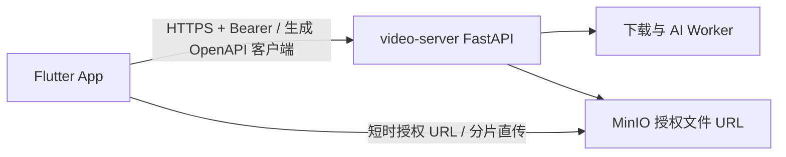

# 目标与边界

帧取 App 是自托管 `video-server` 的 Flutter 原生客户端，只支持 iOS 与 Android，提供原生认证、链接解析、文件上传、下载与分析任务管理、媒体播放、分析报告与（管理员）移动管理中心。

**非目标（变更前必须先更新本文与 PROJECT.md）**

- 不启用 Flutter Web，不用 WebView 复用前端页面，不复制 Web 的 DOM／Radix 实现。
- 不在设备上运行 yt-dlp、FFmpeg、提取器或 AI 模型；不在 App 中保存或维护第三方平台会话。
- 不做分享扩展、推送、后台常驻下载、离线媒体库、批量任务；桌面／电视／车机不在范围内。
- 不获取平台 Cookie、不绕过 DRM、不处理用户无权访问的内容。

App 只负责输入、展示、原生会话、生命周期与文件落地；解析、Provider、异步执行、权限与状态事实全部以服务端为准。
